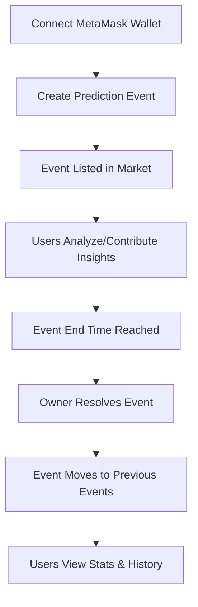

# Prediction Market DApp

A modern, full-stack blockchain-based prediction market built on Ethereum. Users can create, analyze, and resolve prediction events, with a beautiful Material-UI frontend and robust smart contract backend. This platform is designed for market analysis, event forecasting, and generating collective insights.

---

## Table of Contents
- [Features](#features)
- [Workflow](#workflow)
- [Installation](#installation)
- [Project Structure](#project-structure)
- [Troubleshooting](#troubleshooting)
- [Customization](#customization)
- [Contributors](#contributors)
- [License](#license)

---

## Features
- Create, view, and resolve prediction events
- Modern dashboard: Home, Market, Create Event, Previous Event, My Event, Profile
- MetaMask integration for wallet connection and transactions
- Real-time updates for predictions
- User statistics and analytics (profile page)
- Category-based filtering
- Responsive, clean UI using Material-UI
- Designed for market analysis and event forecasting

---

## Workflow
1. Connect MetaMask wallet to the app.
2. Create a new prediction event from the "Create Event" page.
3. The event appears in the "Market" (active predictions).
4. Users can participate in market analysis by contributing their insights to active predictions.
5. When the event's end time is reached, the contract owner can resolve it.
6. Resolved events move to the "Previous Event" page.
7. Users can view their own events and stats in "My Event" and "Profile".

---

## Visual Workflow

## Technologies Used

- Blockchain: Ethereum (Smart Contracts written in Solidity)
- Frontend: React.js, Bootstrap
- Backend: Web3.js for blockchain communication
- Development Tools: Truffle, Ganache, MetaMask

---
## Installation
### Prerequisites
- Node.js (v16+ recommended)
- npm
- Ganache (for local Ethereum blockchain)
- MetaMask (browser extension)

### Steps
1. **Clone the Repository**
   ```sh
   git clone https://github.com/switch41/prediction-market.git
   cd prediction-market
   ```
2. **Install Frontend Dependencies**
   ```sh
   cd frontend
   npm install
   ```
3. **Deploy Smart Contract**
   - Start Ganache.
   - Deploy the contract using Truffle/Hardhat/Remix.
   - Copy the deployed contract address and ABI to `frontend/src/contracts/PredictionMarket.json`.
4. **Run the App**
   ```sh
   npm start
   ```
   - Run this from inside the `frontend` directory.
   - The app will start on [http://localhost:3000](http://localhost:3000) by default.
   - If port 3000 is busy, you can run on another port when prompted.

---


## Project Structure
```
frontend/
  public/
    index.html
  src/
    components/
      Navbar.js
      ...
    pages/
      Home.js
      Market.js
      CreatePrediction.js
      PreviousEvent.js
      MyEvents.js
      Profile.js
    contracts/
      PredictionMarket.json
    App.js
    index.js
contracts/
  PredictionMarket.sol
migrations/
test/
truffle-config.js
README.md
```

---

## Troubleshooting
- **index.html not found:** Run `npm start` from inside the `frontend` directory.
- **No 'from' address specified:** Ensure MetaMask is installed, unlocked, and connected. The app requests MetaMask connection before sending transactions.
- **Port 3000 busy:** Open [http://localhost:3000](http://localhost:3000) or choose another port when prompted.
- **Babel warning about @babel/plugin-proposal-private-property-in-object:** Run `npm install --save-dev @babel/plugin-proposal-private-property-in-object`.

---

## Customization
- Style the dashboard using Material-UI themes in `src/index.js`.
- Add more event categories by updating the dropdown in `CreatePrediction.js` and the contract if needed.

---

## Contributors
- Kushal Parihar ([@switch41](https://github.com/switch41))

---
## License
This project is liscend under the MIT 

---
## Works that still need to be addressed

Tesing has not been done yet,
Feel free to submit pull requests for improvements and additional features!
Any suggestions and useful changes are appreciated.


